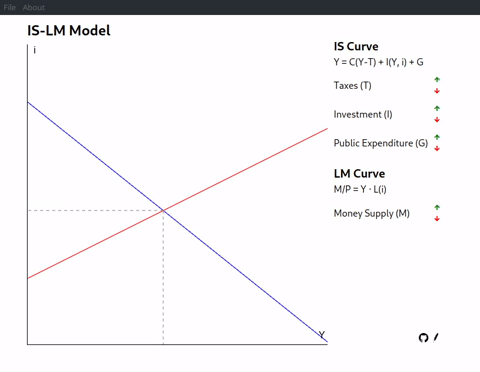

# IS-LM Model App

This App draws an IS (Investment-Savings) function and an LM (Liquidity-Money) function, and see how changes in investment, public expenditure, taxes, and money supply affect them.

This project was bootstrapped with [Create React App](https://github.com/facebook/create-react-app).

## Quick start

Click [here](https://github.com/juanlucasl/is-lm-model/releases/latest/download/IS-LM-1.0.0-build.zip) to download a zip file with the app. You can then extract the contents of the zip file and open the `index.html` file in your browser to view the app.

### Prerequisites

Before you begin, ensure you have met the following requirements:

- `node.js`: `v16` or later.
- `npm`: `v8` or later.

### Launching the app

1. Download or clone the repository and run `npm install` in the root directory.
2. Run `npm start` to launch the app in your web browser.

You can also launch the app as a desktop executable running `npm run start:electron` or `npm run build:electron:` for your operative system.

## Available Scripts

In the project directory, you can run:

### `npm start`

Runs the app in the development mode.\
Open [http://localhost:3000](http://localhost:3000) to view it in the browser.

The page will reload if you make edits.\
You will also see any lint errors in the console.

### `npm test`

Launches the test runner in the interactive watch mode.\
See the section about [running tests](https://facebook.github.io/create-react-app/docs/running-tests) for more information.

### `npm run build`

Builds the app for production to the `build` folder.\
It correctly bundles React in production mode and optimizes the build for the best performance.

The build is minified and the filenames include the hashes.\
Your app is ready to be deployed!

See the section about [deployment](https://facebook.github.io/create-react-app/docs/deployment) for more information.

### `npm run eject`

**Note: this is a one-way operation. Once you `eject`, you can’t go back!**

If you aren’t satisfied with the build tool and configuration choices, you can `eject` at any time. This command will remove the single build dependency from your project.

Instead, it will copy all the configuration files and the transitive dependencies (webpack, Babel, ESLint, etc) right into your project so you have full control over them. All of the commands except `eject` will still work, but they will point to the copied scripts so you can tweak them. At this point you’re on your own.

You don’t have to ever use `eject`. The curated feature set is suitable for small and middle deployments, and you shouldn’t feel obligated to use this feature. However we understand that this tool wouldn’t be useful if you couldn’t customize it when you are ready for it.

### `npm run clean`

Deletes the `build` and `dist` folders.

### `npm run start:electron`

Runs the app in development mode and launches the Electron app. It uses `concurrently` to run two processes simultaneously: `npm start` to start the React app and `electronmon` to start the Electron app.

The `wait-on` command is used to wait until the React app is ready at `http://localhost:3000` before launching the Electron app.

### `npm run build:electron:linux`

Cleans the build directory, builds the app, and packages it into a Linux executable using Electron Builder.

### `npm run build:electron:win`

Cleans the build directory, builds the app, and packages it into a Windows executable using Electron Builder.

### `npm run build:electron:mac`

Cleans the build directory, builds the app, and packages it into a macOS executable using Electron Builder.

### `npm run prettier:fix`

Formats the code using `prettier`.

### `npm run eslint:fix`

Fixes linting errors in Javascript or Typescript files using `ESLint`.

### `npm run lint:css:fix`

Fixes linting errors in CSS files using `stylelint`.

### `npm run format-code`

Runs `npm run prettier:fix`, `npm run eslint:fix` and `npm run lint:css:fix`.

## Learn More

You can learn more in the [Create React App documentation](https://facebook.github.io/create-react-app/docs/getting-started).

To learn React, check out the [React documentation](https://reactjs.org/).

## License

This project is licensed under the Apache License 2.0. See [LICENSE](LICENSE) for more information.
